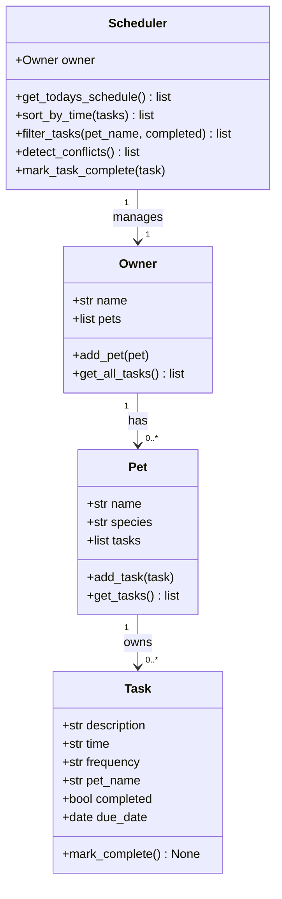

# PawPal+ (Module 2 Project)

You are building **PawPal+**, a Streamlit app that helps a pet owner plan care tasks for their pet.

## Scenario

A busy pet owner needs help staying consistent with pet care. They want an assistant that can:

- Track pet care tasks (walks, feeding, meds, enrichment, grooming, etc.)
- Consider constraints (time available, priority, owner preferences)
- Produce a daily plan and explain why it chose that plan

Your job is to design the system first (UML), then implement the logic in Python, then connect it to the Streamlit UI.

## What you will build

Your final app should:

- Let a user enter basic owner + pet info
- Let a user add/edit tasks (duration + priority at minimum)
- Generate a daily schedule/plan based on constraints and priorities
- Display the plan clearly (and ideally explain the reasoning)
- Include tests for the most important scheduling behaviors

## Getting started

### Setup

```bash
python -m venv .venv
source .venv/bin/activate  # Windows: .venv\Scripts\activate
pip install -r requirements.txt
streamlit run app.py
```

### Suggested workflow

1. Read the scenario carefully and identify requirements and edge cases.
2. Draft a UML diagram (classes, attributes, methods, relationships).
3. Convert UML into Python class stubs (no logic yet).
4. Implement scheduling logic in small increments.
5. Add tests to verify key behaviors.
6. Connect your logic to the Streamlit UI in `app.py`.
7. Refine UML so it matches what you actually built.

---

## Features

- **Owner & Pet management** — Create an owner and register multiple pets of any species.
- **Task scheduling** — Assign tasks (description, time, frequency) to individual pets.
- **Sorting by time** — `Scheduler.sort_by_time()` orders all tasks chronologically using HH:MM string comparison.
- **Filtering** — Filter the task list by pet name, completion status, or both simultaneously.
- **Conflict warnings** — `Scheduler.detect_conflicts()` flags any two tasks scheduled at the same time and surfaces the warning in the UI via `st.warning`.
- **Recurring tasks** — Marking a `daily` or `weekly` task complete automatically generates the next occurrence with the correct due date (`timedelta`). One-time tasks (`once`) do not recur.
- **Mark complete** — Tasks can be marked done from the Streamlit UI; recurring tasks show the next scheduled date.

## Smarter Scheduling

The `Scheduler` class adds algorithmic intelligence beyond a simple list:

| Feature | Method | How it works |
|---|---|---|
| Time sorting | `sort_by_time()` | `sorted()` with a `lambda t: t.time` key — works because HH:MM strings sort lexicographically |
| Filtering | `filter_tasks(pet_name, completed)` | List comprehension with optional predicates |
| Conflict detection | `detect_conflicts()` | Single-pass dict scan: O(n), returns warnings instead of raising exceptions |
| Recurrence | `mark_task_complete()` + `Task.mark_complete()` | Returns next `Task` with `due_date + timedelta`; Scheduler adds it to the pet's list |

## System Architecture (UML)



## Testing PawPal+

Run the full test suite with:

```bash
python -m pytest
```

The suite covers:

- **Task completion** — `mark_complete()` sets the `completed` flag to `True`.
- **Task addition** — Adding a task to a `Pet` increases its task count.
- **Pet name stamping** — `Pet.add_task()` sets `task.pet_name` automatically.
- **Daily recurrence** — Completing a daily task produces a new task dated +1 day.
- **Weekly recurrence** — Completing a weekly task produces a new task dated +7 days.
- **One-time tasks** — Completing a `once` task returns `None` (no recurrence).
- **Scheduler recurrence wiring** — `mark_task_complete` adds the next task to the pet's list.
- **Sorting correctness** — `sort_by_time()` returns tasks in chronological order.
- **Empty schedule** — Sorting an owner with no tasks returns `[]`.
- **Filtering by pet** — Only the target pet's tasks are returned.
- **Filtering pending/done** — Status filter correctly partitions the task list.
- **Conflict detection** — Two tasks at the same time trigger exactly one warning.
- **No false conflicts** — Different times on the same pet produce zero warnings.

**Confidence level: 5/5** — All 15 tests pass and cover happy paths, recurrence edge cases, and conflict detection boundaries.
