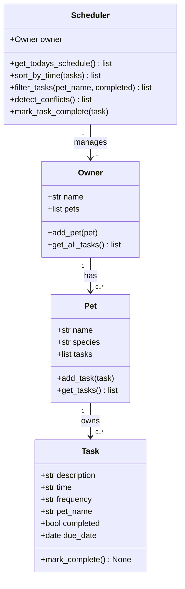

# PawPal+ (Module 2 Project)

You are building **PawPal+**, a Streamlit app that helps a pet owner plan care tasks for their pet.

## Scenario

A busy pet owner needs help staying consistent with pet care. They want an assistant that can:

- Track pet care tasks (walks, feeding, meds, enrichment, grooming, etc.)
- Consider constraints (time available, priority, owner preferences)
- Produce a daily plan and explain why it chose that plan

Your job is to design the system first (UML), then implement the logic in Python, then connect it to the Streamlit UI.

## What you will build

Your final app should:

- Let a user enter basic owner + pet info
- Let a user add/edit tasks (duration + priority at minimum)
- Generate a daily schedule/plan based on constraints and priorities
- Display the plan clearly (and ideally explain the reasoning)
- Include tests for the most important scheduling behaviors

## Getting started

### Setup

```bash
python -m venv .venv
source .venv/bin/activate  # Windows: .venv\Scripts\activate
pip install -r requirements.txt
streamlit run app.py
```

### Suggested workflow

1. Read the scenario carefully and identify requirements and edge cases.
2. Draft a UML diagram (classes, attributes, methods, relationships).
3. Convert UML into Python class stubs (no logic yet).
4. Implement scheduling logic in small increments.
5. Add tests to verify key behaviors.
6. Connect your logic to the Streamlit UI in `app.py`.
7. Refine UML so it matches what you actually built.

---

## Features

The app lets you create an owner, add multiple pets, and schedule tasks for each one. Tasks have a time, frequency (once, daily, or weekly), and completion status. The schedule is sorted by time automatically and conflict warnings show up if two tasks are at the same time. Recurring tasks roll forward to the next day or week when marked done instead of disappearing.

## Smarter Scheduling

The Scheduler class handles the main logic. Sorting uses Python's `sorted()` with a lambda on the HH:MM time string since zero-padded time strings sort correctly as plain strings. Filtering takes optional pet name and completion status arguments. Conflict detection does a single pass through all tasks and returns warning messages instead of crashing. Recurring tasks update in place when completed so there are no duplicates in the list.

## System Architecture (UML)



## Testing PawPal+ and 📸 Demo


The tests cover marking tasks complete, adding tasks to a pet, daily and weekly recurrence updating the due date, one-time tasks becoming done and staying in the list, sort order, filtering by pet name and status, and conflict detection both triggering and not triggering when it should not.

All 15 tests pass. Confidence level 5/5.
